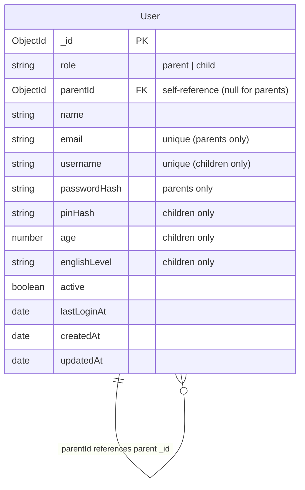

# Database Structure

The project uses MongoDB as the primary database with Mongoose as the Object Data Mapper (ODM). This document outlines the schema designs, collections, and the representations of the models across the services.

---

## 1. User Models (Parents and Children)

Parents and Children are stored in the same MongoDB collection (`users`) using a **Single Collection Inheritance Pattern**. They share common fields but are differentiated by their `role` and have different validation constraints based on that role.

### The Parent-Child Relationship

The relationship between parents and children is modeled as a **one-to-many self-referencing relationship**:
- The **Parent** user document has `parentId` set to `null` (default).
- The **Child** user document has a `parentId` field referencing the parent's `_id`.
- Storing a child-to-parent reference (instead of an array of child IDs on the parent) avoids concurrency issues when adding/modifying children and allows scaling to an arbitrary number of children.

### Collection Schema: `users`

Here is the detailed specification of the fields in the `users` collection:

#### Common Fields (All Users)

| Field Name | Type | Description | Constraints / Details |
| :--- | :--- | :--- | :--- |
| `_id` | `ObjectId` | Unique user identifier | Generated automatically by MongoDB |
| `role` | `String` | Role of the user | Required, indexed. Must be `"parent"` or `"child"` |
| `name` | `String` | Display name of the user | Required, trimmed, length: 2 to 80 characters |
| `active` | `Boolean` | Account status | Defaults to `true` |
| `lastLoginAt` | `Date` | Timestamp of the last login | Defaults to `null` |
| `createdAt` | `Date` | Timestamp of account creation | Auto-generated by Mongoose timestamps |
| `updatedAt` | `Date` | Timestamp of last modification | Auto-generated by Mongoose timestamps |

#### Parent-Specific Fields

These fields are relevant and required only when `role === "parent"` (enforced via schema pre-validation middleware):

| Field Name | Type | Description | Constraints / Details |
| :--- | :--- | :--- | :--- |
| `email` | `String` | Parent's email address | Required, unique, sparse, lowercase, format validated (`/^\S+@\S+\.\S+$/`) |
| `passwordHash` | `String` | Hashed password for authentication | Required, hidden from standard queries (`select: false`) |
| `parentId` | `ObjectId` | Reference to parent | Always `null` |

#### Child-Specific Fields

These fields are relevant and required/optional only when `role === "child"` (enforced via schema pre-validation middleware):

| Field Name | Type | Description | Constraints / Details |
| :--- | :--- | :--- | :--- |
| `parentId` | `ObjectId` | Link to the child's parent | Required, indexed, references `users` collection |
| `username` | `String` | Unique username for child login | Required, unique, sparse, lowercase, length: 3 to 40 characters |
| `pinHash` | `String` | Hashed 4-digit PIN for authentication | Required, hidden from standard queries (`select: false`) |
| `age` | `Number` | Child's age | Optional, range: 6 to 12 years old |
| `englishLevel` | `String` | Child's English proficiency level | Optional, must be `"beginner"`, `"basic"`, or `"intermediate"` |

---

### Logical Constraints & Pre-Validation

The schema uses pre-validation hooks (`validateRoleFields`) to enforce the following data integrity constraints before saving a document:
- **For Parents (`role === "parent"`)**:
  - `email` is required.
  - `passwordHash` is required.
- **For Children (`role === "child"`)**:
  - `parentId` is required.
  - `username` is required.
  - `pinHash` is required.

---

## 2. Game Models

The game-related models are managed by the `game-service` and store game configurations, questions, and active play sessions.

### Collection Schema: `gametypes`

Stores the different types of games available along with their configured questions.

| Field Name | Type | Description | Constraints / Details |
| :--- | :--- | :--- | :--- |
| `id` | `String` | Game type identifier | Required, unique, lowercase, trimmed |
| `name` | `String` | Name of the game type | Required, trimmed |
| `description`| `String` | Description of the game | Defaults to empty string, trimmed |
| `active` | `Boolean` | Whether the game type is active | Defaults to `true`, indexed |
| `questions` | `Array` | Array of questions for this game type | Structured subdocument list (see below) |

---

#### Question Sub-Schema

Each question in the `questions` array consists of:

| Field Name | Type | Description | Constraints / Details |
| :--- | :--- | :--- | :--- |
| `id` | `String` | Unique question identifier | Required, trimmed |
| `text` | `String` | Question prompt / text | Defaults to empty string, trimmed |
| `imageUrl` | `String` | URL for question image (if any) | Defaults to `null` |
| `options` | `Array` | List of answer choices | Structured list (see below). Must have >= 2 options and >= 1 correct option |
| `points` | `Number` | Points rewarded on correct answer | Defaults to `10`, min `0` |
| `active` | `Boolean` | Active status of the question | Defaults to `true` |

##### Option Sub-Schema

Each option in the `options` array consists of:
- `id`: `String` (Required, trimmed)
- `text`: `String` (Required, trimmed)
- `isCorrect`: `Boolean` (Defaults to `false`)

---

### Collection Schema: `gamesessions`

Tracks the progress and metrics of a play session for a specific user playing a specific game.

| Field Name | Type | Description | Constraints / Details |
| :--- | :--- | :--- | :--- |
| `sessionKey` | `String` | Key identifying the session (e.g. child user reference) | Required, indexed |
| `gameId` | `String` | Game identifier | Required, indexed, lowercase, trimmed |
| `activeQuestionId` | `String` | Currently active question in the session | Defaults to `null` |
| `score` | `Number` | Points accumulated in this session | Defaults to `0`, min `0` |
| `answeredQuestions` | `Array` | History of answered questions | Structured list (see below) |
| `status` | `String` | State of the session | Required, indexed. Must be `"active"` or `"completed"` |
| `length` | `Number` | Active session duration in seconds | Defaults to `0` |
| `createdAt` | `Date` | Timestamp of session creation | Auto-generated by Mongoose timestamps |
| `updatedAt` | `Date` | Timestamp of last activity / update | Auto-generated by Mongoose timestamps |

*Note: There is a unique compound index on `{ sessionKey: 1, gameId: 1 }` filtered with `{ partialFilterExpression: { status: "active" } }` so a user can have only one active session at a time, but multiple completed sessions.*

#### Answered Question Sub-Schema

Each answered question in the `answeredQuestions` array consists of:
- `questionId`: `String` (Required)
- `answerId`: `String` (Required)
- `correct`: `Boolean` (Required)
- `pointsEarned`: `Number` (Defaults to `0`)
- `answeredAt`: `Date` (Defaults to `Date.now`)

---

## 3. Reporting Models

The reporting-related models track gamification progress and achievements, stored in the `reporting-service`.

### Collection Schema: `progresses`

Tracks the "Grammar Hero" gamification points, rank, and achievements for a specific user (child).

| Field Name | Type | Description | Constraints / Details |
| :--- | :--- | :--- | :--- |
| `userId` | `ObjectId` | Reference to the child user | Required, indexed |
| `points` | `Number` | Total accumulated gamification points | Defaults to `0`, min `0` |
| `rank` | `String` | Current title or rank (e.g. Beginner) | Defaults to `"Beginner"`, trimmed |
| `achievements` | `Array` | List of achievement badges earned | Array of Strings, default empty `[]` |
| `createdAt` | `Date` | Timestamp of document creation | Auto-generated by Mongoose timestamps |
| `updatedAt` | `Date` | Timestamp of last update | Auto-generated by Mongoose timestamps |

#### Gamification Events System

The gamification system awards points and checks against thresholds (e.g., 100 points -> "Intermediate Rank", 500 points -> "Grammar Hero Rank"). Achievements are strings like `"FIRST_GAME"`, `"PLAYED_10_MINS"`.

