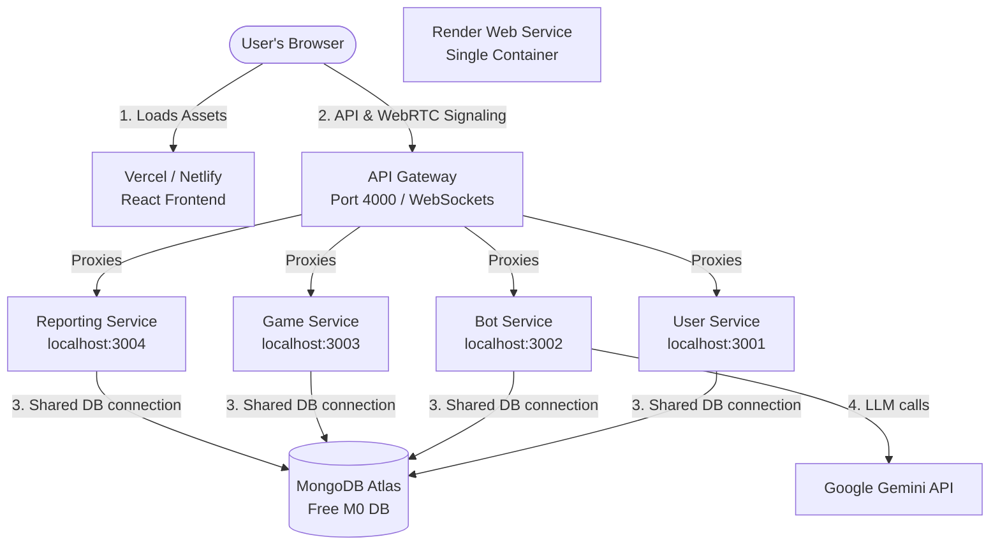

# Free & Easy Production Deployment Guide

This document details how to deploy the English Learning Bot monorepo to production using **100% free-tier services**. It explains the architecture, the code changes made to support separate frontend/backend hosting, and step-by-step setup guides for each platform.

> [!IMPORTANT]
> **NOTE FOR AI AGENTS:** If you modify configurations, add environment variables, or update services that affect how this application is run or deployed, **you MUST update this guide** to keep it current.

---

## 1. General Architecture & Free Tier Strategy

To deploy the entire system (1 frontend + 5 backend services + 1 database) for free without running out of limits or requiring credit cards, we leverage the following services:

| Component | Target Platform | Free Tier Benefits | Why This Choice? |
| :--- | :--- | :--- | :--- |
| **Database** | **MongoDB Atlas** | Shared M0 Cluster, 512MB Storage, Free Forever. | No credit card required, fully managed cloud database. |
| **Backend Services**<br>(Gateway + 4 Microservices) | **Render** (Web Service) | 750 free instance hours/month. | We bundle all 5 backend services into **one single Render Web Service** to bypass free private service restrictions and stay within the 750 hours/month limit. |
| **Frontend Assets** | **Vercel** or **Netlify** | Unlimited deployments, fast global CDN, 100GB bandwidth. | Free forever, no cold starts, easy setup for Vite monorepos. |



---

## 2. Necessary Code Changes (Already Applied)

In local development, the Vite dev server proxies `/api` calls directly to the API Gateway. In production, the static frontend runs on a separate domain (e.g. Vercel) and must call the Render backend directly. 

To support separate frontend and backend hosting, we modified the following frontend files in the `EX2/packages/frontend/src/features` folder:

1. **[userApi.js](file:///Users/oshriagronov/Documents/Projects/WEB-group-4/EX2/packages/frontend/src/features/user/logic/userApi.js)**:
   - *Before:* `const API_BASE = import.meta.env.VITE_API_URL ?? "/api/users";`
   - *After:* 
     ```javascript
     const API_BASE = import.meta.env.VITE_API_URL 
       ? `${import.meta.env.VITE_API_URL}/api/users` 
       : "/api/users";
     ```
2. **[gameApi.js](file:///Users/oshriagronov/Documents/Projects/WEB-group-4/EX2/packages/frontend/src/features/game/logic/gameApi.js)**:
   - *Before:* `const GAME_API = import.meta.env.VITE_API_URL ?? "/api/games";`
   - *After:* 
     ```javascript
     const GAME_API = import.meta.env.VITE_API_URL 
       ? `${import.meta.env.VITE_API_URL}/api/games` 
       : "/api/games";
     ```
3. **[botApi.js](file:///Users/oshriagronov/Documents/Projects/WEB-group-4/EX2/packages/frontend/src/features/bot/logic/botApi.js)**:
   - *Before:* `const BOT_API = import.meta.env.VITE_API_URL ?? "/api/bot";`
   - *After:* 
     ```javascript
     const BOT_API = import.meta.env.VITE_API_URL 
       ? `${import.meta.env.VITE_API_URL}/api/bot` 
       : "/api/bot";
     ```

*Why was this necessary?* If `VITE_API_URL` is set to `https://api.onrender.com`, the old code would request `https://api.onrender.com/login` (instead of `https://api.onrender.com/api/users/login`), resulting in a 404. The new logic correctly prepends the gateway service endpoints.

---

## 3. Production Multi-Process Backend Launcher

Render restricts **Private Services** to paid plans and pools free instance hours. To host 5 backend microservices for free:
- We created **[start-production.mjs](file:///Users/oshriagronov/Documents/Projects/WEB-group-4/EX2/start-production.mjs)** at the root of `EX2`.
- When Render runs `npm start`, this script spawns all 5 microservices as child processes in the *same container*, running them on their standard localhost ports (`3001`–`3004`) while the `api-gateway` binds to the public port.
- This setup only consumes **one Render free Web Service instance**, utilizing exactly 720–744 hours per month (well under the 750 free-hour pool limit).
- If any service crashes, the script automatically terminates the parent container, allowing Render to automatically spin up a fresh, self-healed instance.

---

## 4. Step-by-Step Deployment Guide

### STEP 1: Deploy MongoDB Database (MongoDB Atlas)
1. Go to [MongoDB Atlas](https://www.mongodb.com/cloud/atlas) and sign up for a free account.
2. Create a new project, and click **Create a Database**.
3. Select the **M0 Free** tier, choose your preferred cloud provider and region, and click **Create**.
4. In the **Security Quickstart**:
   - Create a database user (note down the username and password).
   - Set the IP Access List to `0.0.0.0/0` (Allows connection requests from Render's dynamic IP range).
5. Navigate to **Database** -> click **Connect** -> select **Drivers** -> Copy the connection string.
   - It will look like: `mongodb+srv://<username>:<password>@cluster0.xxxx.mongodb.net/english_learning_bot?retryWrites=true&w=majority`
   - Replace `<username>` and `<password>` with your database user credentials.

---

### STEP 2: Deploy Backend Services (Render)
1. Go to [Render](https://render.com/) and log in.
2. Click **New +** -> Select **Web Service**.
3. Connect your GitHub repository.
4. Set the following configuration options:
   - **Name**: `english-learning-bot-backend` (or similar)
   - **Region**: Select a region close to you or your database.
   - **Language**: `Node`
   - **Branch**: `main` (or your active branch)
   - **Root Directory**: `EX2`
   - **Build Command**: `npm install`
   - **Start Command**: `node start-production.mjs`
   - **Instance Type**: `Free`
5. Click **Advanced** and add the following **Environment Variables**:
   - `PORT`: `10000` (Render's default public port, which the API Gateway will bind to)
   - `MONGO_URI`: *Your MongoDB Atlas connection string from Step 1*
   - `JWT_SECRET`: *A random secure string for user authentication tokens*
   - `GEMINI_API_KEY`: *Your Google Gemini AI API key (for the Bot Service)*
   - `NODE_ENV`: `production`
6. Click **Create Web Service** and wait for the deployment to finish. Note down the public URL of your service (e.g. `https://english-learning-bot-backend.onrender.com`).

#### ⚠️ Handling Inactivity (Preventing Sleep)
Render's free tier spins down web services after 15 minutes of inactivity, causing a ~50 second delay (cold start) on the next request.
- **Solution:** Create a free account on [cron-job.org](https://cron-job.org) or [UptimeRobot](https://uptimerobot.com).
- Add a monitor that pings your API Gateway's health check endpoint every 10 minutes:
  `https://your-backend-url.onrender.com/health`
- This keeps your free backend active and responsive 24/7.

---

### STEP 3: Deploy React Frontend (Vercel or Netlify)

You can choose either **Vercel** or **Netlify**. Both are free and excellent for Vite monorepos.

#### Option A: Vercel Setup (Recommended)
1. Sign up/log in to [Vercel](https://vercel.com).
2. Click **Add New** -> **Project** -> Import your GitHub repository.
3. In the project settings, configure:
   - **Framework Preset**: `Vite`
   - **Root Directory**: Click `Edit` and select `EX2/packages/frontend`.
4. Expand **Build and Development Settings**:
   - Ensure the build command is `npm run build` and output directory is `dist`.
5. Expand **Environment Variables** and add:
   - Key: `VITE_API_URL`
   - Value: *Your Render Backend URL from Step 2* (e.g., `https://english-learning-bot-backend.onrender.com`)
6. Click **Deploy**. Vercel will build and serve your static assets.

#### Option B: Netlify Setup
1. Sign up/log in to [Netlify](https://netlify.com).
2. Click **Add new site** -> **Import from Git** -> Connect your repository.
3. Configure the site settings:
   - **Branch to deploy**: `main`
   - **Base directory**: `EX2/packages/frontend`
   - **Build command**: `npm run build`
   - **Publish directory**: `EX2/packages/frontend/dist`
4. Go to **Site Configuration** -> **Environment variables** and add:
   - Key: `VITE_API_URL`
   - Value: *Your Render Backend URL from Step 2*
5. Click **Deploy Site**.

---

### STEP 4: WebRTC Signaling & STUN/TURN Setup

The Practice Arena uses WebRTC for peer-to-peer voice chat.
1. **Free STUN Servers (Default):** The application is pre-configured to use Google's public STUN servers (`stun:stun.l.google.com:19302`). This covers NAT traversal for 90% of home users for free.
2. **TURN Servers (Optional):** If users are on highly restrictive corporate firewalls or symmetric NATs, a TURN server is required.
   - You can get a free TURN server tier from services like **Xirsys** or **Twilio Network Traversal API**.
   - If you set up a TURN server, configure these environment variables on Vercel/Netlify for the frontend:
     - `VITE_TURN_URL`: `turn:your-turn-server.com:3478`
     - `VITE_TURN_USERNAME`: `your-username`
     - `VITE_TURN_PASSWORD`: `your-password`
     - `VITE_STUN_SERVERS`: `stun:stun.l.google.com:19302` (comma-separated list of STUN servers)

---

## 5. Verification Checklist

After deploying, verify the deployment is working correctly:
1. **Frontend Load**: Open your frontend domain (Vercel/Netlify URL). The login/register screen should load.
2. **Auth Service**: Register a new user and log in. This verifies the **User Service** and **MongoDB Atlas** connection.
3. **AI Bot Chat**: Start a chat session with the English bot. If it responds, the **Bot Service** and **Gemini API Key** are configured correctly.
4. **Gamification**: Complete a task or game and verify points update in the profile. This verifies **Reporting Service** and **WebSockets** connection.
5. **Practice Arena**: Open two different browser tabs (or log in on two devices), join the same Arena room, and verify WebRTC audio connection and signaling.
