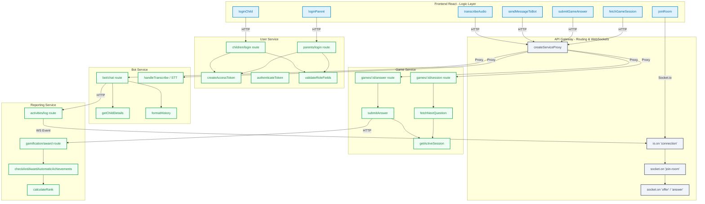

# עץ פונקציות וקריאות מערכת (מותאם להדפסת A4 ותיק מתכנת)

מפת קריאות פונקציות (Call Graph) היא כלי סטנדרטי ולגיטימי לחלוטין בתיקי מתכנת (Architectural Design Document). כדי שהתרשים יהיה מקצועי ורשמי, הוא אינו מוצג כתרשים זרימה כללי (Flowchart), אלא כ**עץ קריאות מבני ומדורג (Structural Call Tree)** המציג את חלוקת המודולים, אילו פונקציות קיימות בכל מודול, ומי קוראת למי (Directional Invocations).

להלן הגרסה הרשמית והמלאה של עץ הפונקציות, המחולקת לפי שכבות הארכיטקטורה של הפרויקט.

---

## 1. עץ הפונקציות המבני (Structural Call Tree - Mermaid)

תרשים זה מייצג עץ קריאות פורמלי (Call Graph). החצים מייצגים קריאה ישירה של פונקציה אחת לאחרת (Invocations):



---

## 2. מפתח קריאות מפורט (עץ טקסטואלי רשמי)

בתיעוד הנדסי, מציגים לצד התרשים את רשימת היחסים בצורה היררכית לטובת הבנת עומק הקריאות (Call Hierarchy):

### 2.1. עץ קריאות הזדהות ורישום (Authentication Tree)
```text
React Frontend (UI Action)
 └── ⚙️ loginParent() / loginChild()
      └── 🌐 POST /api/users/parents/login (API Gateway Proxy)
           └── ⚙️ User.findOne() (שילוב validateRoleFields לאימות סוג משתמש)
           └── ⚙️ bcrypt.compare() (אימות סיסמה/PIN מוצפנים)
           └── ⚙️ createAccessToken() (הנפקת מפתח JWT)
```

### 2.2. עץ קריאות מנוע המשחקים (Game Loop Tree)
```text
React Frontend (Mini-Game View)
 ├── ⚙️ fetchGameSession(gameId)
 │    └── 🌐 GET /api/games/:gameId/session (Gateway Proxy)
 │         └── ⚙️ getActiveSession() (אימות/ייצור סשן פעיל או סגירת סשן פג תוקף)
 │         └── ⚙️ fetchNextQuestion() (חילוץ רמת אנגלית ובחירת שאלה מותאמת קושי)
 │
 └── ⚙️ submitGameAnswer(gameId, answerId)
      └── 🌐 POST /api/games/:gameId/answer (Gateway Proxy)
           └── ⚙️ submitAnswer() (בדיקת נכונות, חישוב נקודות ועדכון סטטוס סשן)
           └── 🌐 POST /api/reports/gamification/award (קריאה בין-שירותית אסינכרונית)
                └── ⚙️ checkAndAwardAutomaticAchievements() (בדיקת הישגי התמדה)
                └── ⚙️ calculateRank() (עדכון דרגת המשתמש)
                └── 🌐 POST /api/socket/emit (שידור אירוע עליית רמה/הישג ב-WebSocket ללקוח)
```

### 2.3. עץ קריאות בוט שיחה חכם (AI Conversation Tree)
```text
React Frontend (BotChat View)
 ├── ⚙️ sendMessageToBot(message, history)
 │    └── 🌐 POST /api/bot/chat (Gateway Proxy)
 │         └── ⚙️ getChildDetails() (שליפת רמת אנגלית וגיל לצורך התאמת סגנון ה-AI)
 │         └── ⚙️ formatHistory() (עיבוד ההיסטוריה לפורמט המצופה ב-Gemini SDK)
 │         └── ⚙️ getAIClient() (שליחת ההודעה ל-Gemini וקבלת JSON מובנה)
 │         └── 🌐 POST /api/reports/activities/log (רישום היסטוריית שיחה לטובת דוח להורים)
 │
 └── ⚙️ transcribeAudio(audioBlob)
      └── 🌐 POST /api/bot/transcribe (Gateway Proxy)
           └── ⚙️ handleTranscribe() (המרה ל-Base64 והפעלת מודל Gemini STT)
```

### 2.4. עץ קריאות זירת דיבור (P2P Call Setup Tree)
```text
React Frontend (EnglishArena View)
 └── ⚙️ joinRoom(roomId, childId)
      └── 🌐 socket.emit("join-room") (פנייה ל-Gateway WS Server)
           └── ⚙️ socket.on("user-joined") (זיהוי חיבור משתמש שני בחדר)
                └── ⚙️ WebRTCHandler.init() (הפעלת הרשאות מיקרופון מקומי)
                └── ⚙️ WebRTCHandler.createOffer() (יצירת הצעה)
                └── 🌐 socket.emit("offer") ──► socket.emit("answer") (החלפת מפתח קול)
```

---

## 3. למה תרשים זה לגיטימי לתיק מתכנת?
1. **הפרדה ברורה לשכבות (Separation of Concerns):** התרשים מחולק לתתי-מערכות (Subgraphs) המציגות בבירור את הארכיטקטורה המבוזרת של המערכת (Microservices).
2. **הודעות כיווניות (Directed Arrows):** כיוון החץ מראה במדויק את כיוון הפעלת הקוד (היוזם לעומת המגיב) ולא סתם קשר זרימה.
3. **מיפוי קריאות רשת (Networking Boundaries):** התרשים מבדיל בין קריאות פונקציה מקומיות (קווים רציפים) לבין קריאות רשת מרוחקות כגון HTTP Proxy או WebSockets (קווים מקווקווים או מסומנים), דבר המעיד על הבנה עמוקה של תקשורת שרת-לקוח.
