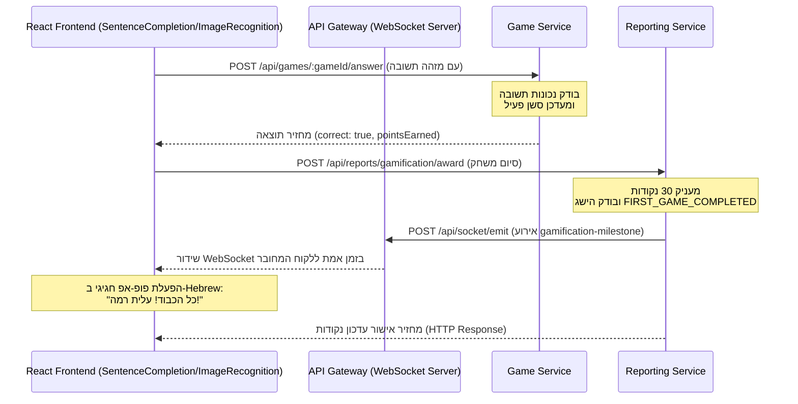
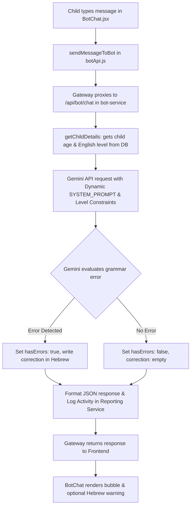
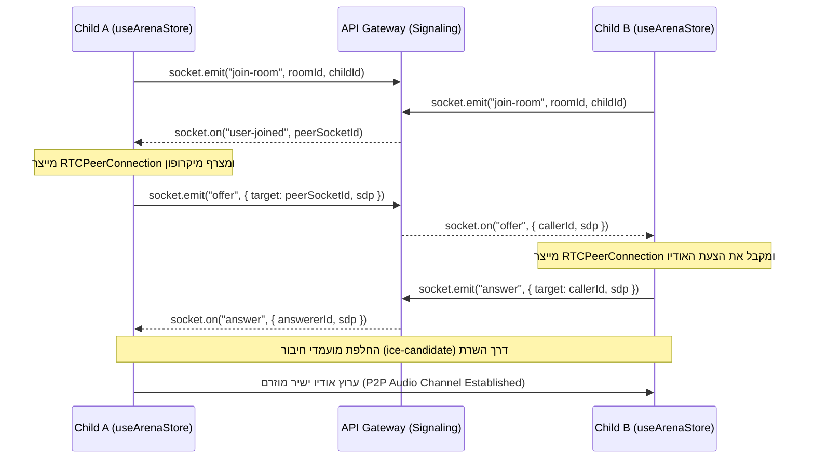

# תיעוד פונקציות מרכזיות ומבנה המערכת

מסמך זה מתעד ומסביר את כל הפונקציות המרכזיות בקוד של מערכת למידת האנגלית (הן בצד השרת והן בצד הלקוח), ומציג עצי פונקציות (תרשימי זרימה וקשרים) המדגימים את האינטראקציה ביניהן.

---

## 1. פירוט הפונקציות המרכזיות לפי רכיבים

### 1.1. שער הגישה והתקשורת (API Gateway)
השער מנהל את ניתוב הבקשות (HTTP Proxy) ומקיים שרת WebSockets לשינוע אירועי גמיפיקציה, עדכוני פעילות וסיגנליזציה עבור תקשורת קולית מבוזרת (WebRTC).

* **`createServiceProxy(targetUrl)`**:
  * **מיקום**: `packages/api-gateway/index.js`
  * **תיאור**: מייצר הגדרות מנהרת ניתוב (Proxy Middleware) מבוססות `http-proxy-middleware` עבור כל אחד מרכיבי המיקרו-שירותים בשרת.
  * **פרמטרים**: `targetUrl` (כתובת היעד של המיקרו-שירות).
  
* **`app.post("/api/socket/emit")`**:
  * **מיקום**: `packages/api-gateway/index.js`
  * **תיאור**: מאפשר למיקרו-שירותים הפנימיים לשלוח בקשות HTTP POST ובכך לבצע הפצה (Broadcast) של אירועי WebSocket ללקוחות מחוברים (למשל, עדכון על קבלת הישג או התקדמות).
  
* **`io.on("connection", (socket) => { ... })`**:
  * **מיקום**: `packages/api-gateway/index.js`
  * **תיאור**: מנהל את חיבורי ה-WebSockets של משתמשי הקצה ומטפל באירועים הבאים:
    * **`gamification-event`**: מפיץ אירועי הישגים בזמן אמת לכלל הלקוחות המחוברים.
    * **`activity-event`**: מפיץ עדכוני פעילות של ילדים אל אזור ההורים.
    * **`join-room`**: מכניס את המשתמש לחדר ייעודי לפי מזהה החדר (`roomId`) לטובת WebRTC.
    * **`offer` / `answer` / `ice-candidate`**: מעביר הודעות סיגנליזציה ישירות בין שני עמיתים (Peer-to-Peer) לצורך יצירת חיבור אודיו ישיר.

---

### 1.2. שירות המשתמשים (User Service)
השירות מנהל את הרשמת ההורים, יצירת פרופילי ילדים וניהול הרשאות מבוססות JWT.

* **`validateRoleFields(next)`**:
  * **מיקום**: `packages/user-service/src/models/User.js`
  * **תיאור**: הוק (Hook) פרה-וולידציה של Mongoose המוודא שלמות נתונים בהתאם לתפקיד המשתמש:
    * עבור **הורה** (`role === "parent"`): דורש `email` ו-`passwordHash`.
    * עבור **ילד** (`role === "child"`): דורש `parentId`, `username` ו-`pinHash`.
    
* **`createAccessToken(user)`**:
  * **מיקום**: `packages/user-service/src/utils/tokens.js`
  * **תיאור**: מייצר טוקן JWT חתום המכיל את מזהה המשתמש (`sub`), התפקיד שלו (`role`) ומזהה ההורה (`parentId`).
  
* **`authenticateToken(req, res, next)`**:
  * **מיקום**: `packages/user-service/src/middleware/authenticateToken.js`
  * **תיאור**: מידלוור (Middleware) המאמת את ה-JWT מתוך כותרת ה-`Authorization` ומצרף את נתוני המשתמש המפוענחים ל-`req.auth`.
  
* **`requireRole(...roles)`**:
  * **מיקום**: `packages/user-service/src/middleware/authenticateToken.js`
  * **תיאור**: חוסם גישה לנתיבים מוגנים במידה ולמשתמש אין תפקיד תואם (למשל, מונע מילד ליצור פרופילי ילדים חדשים).

---

### 1.3. שירות המשחק (Game Service)
מנהל את קטלוג המשחקים, בחירת שאלות מותאמות אישית לרמת הילד, ומעקב אחר מפגשי משחק פעילים.

* **`seedDatabase()`**:
  * **מיקום**: `packages/game-service/src/data/seedData.js`
  * **תיאור**: מאכלס אוטומטית שאלות ברירת מחדל בקולקציית `gametypes` במסד הנתונים בעת הפעלת המערכת.
  
* **`getActiveSession(gameId, sessionKey)`**:
  * **מיקום**: `packages/game-service/src/services/gameService.js`
  * **תיאור**: שולף את הסשן הפעיל של המשתמש עבור משחק מסוים. אם עבר זמן הקצוב (15 דקות), הוא מסמן אותו כהושלם ומאתחל סשן חדש.
  
* **`fetchNextQuestion(gameId, sessionKey)`**:
  * **מיקום**: `packages/game-service/src/services/gameService.js`
  * **תיאור**: שולף את השאלה הבאה עבור המשתמש. הפונקציה שולפת את רמת האנגלית של הילד מתוך פרופיל המשתמש שלו ומסננת את מאגר השאלות כך שיוצגו שאלות ברמת קושי מתאימה (`beginner`, `basic`, `intermediate`).
  
* **`submitAnswer(gameId, answerId, sessionKey)`**:
  * **מיקום**: `packages/game-service/src/services/gameService.js`
  * **תיאור**: בודק האם התשובה שנבחרה נכונה. הפונקציה מחשבת את הנקודות שנצברו, מעדכנת את הסשן הפעיל במסד הנתונים, ומחזירה תוצאה מפורטת.

---

### 1.4. שירות בוט השיחה (Bot/AI Service)
שירות מבוסס AI המנהל את השיחות, מתמלל קול ומנתח שגיאות של התלמיד.

* **`getAIClient()`**:
  * **מיקום**: `packages/bot-service/src/utils/aiPromptSetup.js`
  * **תיאור**: מאתחל ומחזיר את מופע הלקוח של `GoogleGenAI` תוך שימוש במפתח ה-Gemini API מהסביבה.
  
* **`/chat` (Router handler)**:
  * **מיקום**: `packages/bot-service/src/routes/chat.js`
  * **תיאור**: מקבל הודעת משתמש והיסטוריית שיחה. הוא פונה ל-Gemini ומנחה את המודל להחזיר תשובה מותאמת לגיל הילד ורמת האנגלית שלו, בצירוף ניתוח שגיאות דקדוקיות והסברים בעברית. לאחר מכן, הוא פונה אסינכרונית לשירות הדיווח לצורך רישום הפעילות.
  
* **`handleTranscribe(req, res)`**:
  * **מיקום**: `packages/bot-service/src/routes/chat.js`
  * **תיאור**: מקבל קובץ אודיו (מערכים בינאריים או Base64), פונה למודל המולטימודלי `gemini-3.1-flash-lite` ומחזיר תמלול טקסטואלי ישיר (Speech-to-Text).

---

### 1.5. שירות דיווח וגמיפיקציה (Reporting Service)
שירות המנהל את צבירת הנקודות של התלמידים, פתיחת תארים והישגים, ודיווח להורים.

* **`calculateRank(points)`**:
  * **מיקום**: `packages/reporting-service/routes/gamificationRoutes.js`
  * **תיאור**: מחשב את הדרגה (Rank) של הילד על סמך סך נקודותיו (למשל: מעל 500 נקודות = Advanced Learner).
  
* **`checkAndAwardAutomaticAchievements(progress)`**:
  * **מיקום**: `packages/reporting-service/routes/gamificationRoutes.js`
  * **תיאור**: בודק באופן אוטומטי הישגים מבוססי זמן או התמדה. לדוגמה, אם סך זמני המשחקים מגיע ל-10 דקות (600 שניות), מוענק הישג `PLAYED_10_MINS` יחד עם 50 נקודות בונוס.
  
* **`router.post("/award")`**:
  * **מיקום**: `packages/reporting-service/routes/gamificationRoutes.js`
  * **תיאור**: מעניק נקודות ואירועים (למשל: סיום משחק, משפט תקין בצ'אט). במקרה של עליית רמה או הישג חדש, נשלחת הודעת Socket אסינכרונית ל-Gateway להצגת פופ-אפ.
  
* **`router.get("/progress/:userId")`**:
  * **מיקום**: `packages/reporting-service/routes/reportsRoutes.js`
  * **תיאור**: מקבץ את כלל היסטוריית הפעילויות וזמני השימוש של הילד, ומפיק דוח התקדמות הכולל פילוח זמנים, אחוזי הצלחה ורשימת הישגים.

---

### 1.6. צד הלקוח (React Frontend)
מנהל את הממשק ואת ניהול המצבים באמצעות ספריות zustand ו-socket.io-client.

* **`useUserStore`**:
  * **מיקום**: `packages/frontend/src/features/user/data/userStore.js`
  * **תיאור**: מנהל את נתוני המשתמש המחובר (הורה/ילד) ואת ה-Access Token.
  
* **`useGamificationStore`**:
  * **מיקום**: `packages/frontend/src/features/gamification/data/gamificationStore.js`
  * **תיאור**: מנהל את מצב הנקודות והתארים. הוא מקשיב לחיבור ה-WebSocket של ה-Gateway ומפעיל פופ-אפ הנפשה (`milestonePopup`) כאשר התלמיד זוכה בהישג.
  
* **`useArenaStore`**:
  * **מיקום**: `packages/frontend/src/features/arena/data/arenaStore.js`
  * **תיאור**: מנהל את הכניסה לחדרי האודיו הלימודיים. מטפל ביצירת זרם האודיו המקומי וחיבורי WebRTC מבוזרים.
  
* **`WebRTCHandler` (מחלקה)**:
  * **מיקום**: `packages/frontend/src/features/arena/logic/webrtcHandler.js`
  * **תיאור**: עוטפת את חיבור ה-`RTCPeerConnection`. מטפלת ביצירת הצעות (Offers), קבלת תשובות (Answers), שיוך ICE Candidates, והעברת ערוצי קול בין המשתמשים.

---

## 2. עצי פונקציות וזרימות עבודה (Diagrams)

### 2.1. זרימת מעגל גמיפיקציה: סיום משחק וקבלת הישג
תרשים זה מתאר את סדר הקריאות כאשר ילד מסיים משחק בהצלחה ומקבל הישג בזמן אמת דרך WebSockets:

### 2.2. זרימת שיח עם הבוט: שליחת הודעה וניתוח שגיאות
תרשים זה מתאר את התהליך שמתבצע בעת שליחת משפט לצ'אט של הבוט:

### 2.3. זרימת WebRTC: התחברות לזירת אימון דיבור (English Arena)
התרשים מתאר כיצד שני ילדים מתחברים יחד לאותו חדר קול ויוצרים ערוץ תקשורת ישיר:

