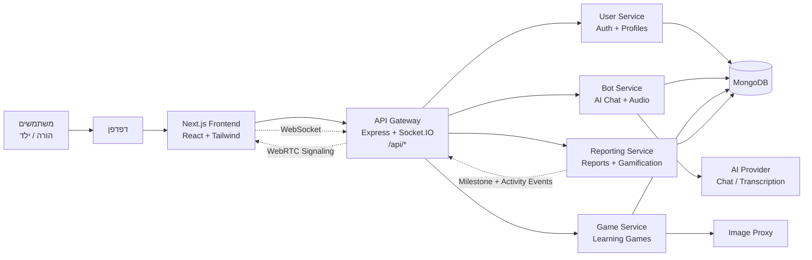
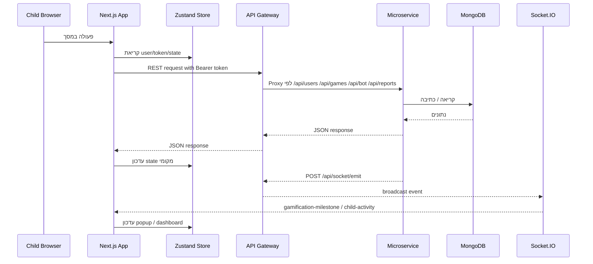
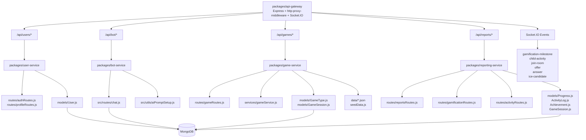
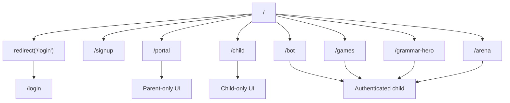
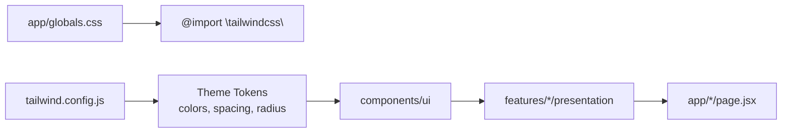
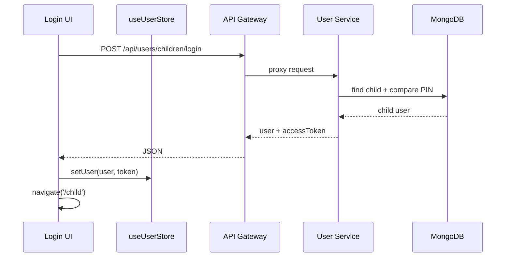
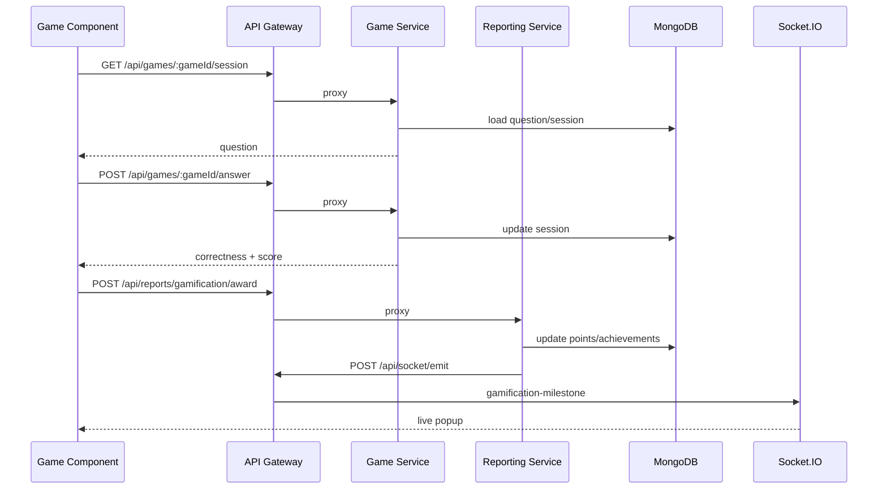

# ארכיטקטורת אתר מעודכנת - React / Next.js / Tailwind

מסמך זה מתאר את הארכיטקטורה המעודכנת של האתר עבור מימוש ב-React עם Next.js ו-Tailwind. בסיס הפיצ'רים נלקח ממבנה הפרויקט הקיים ב-`EX2/packages/frontend/src/features`, והמסמך מציע מיפוי למבנה Next.js App Router.

> הערה: בפרויקט הנוכחי הפרונט רץ עם Vite ו-React Router. הארכיטקטורה כאן היא מבנה היעד המעודכן ל-Next.js, תוך שמירה על חלוקת ה-feature modules הקיימת.

## System Architecture



### רכיבי מערכת מרכזיים

| רכיב | אחריות |
| --- | --- |
| Next.js Frontend | מסכי משתמש, routing לפי קבצים, קומפוננטות React, Tailwind styling, state client-side |
| API Gateway | נקודת כניסה יחידה ל-REST APIs, proxy לשירותים, Socket.IO לאירועים בזמן אמת ול-WebRTC signaling |
| User Service | הרשמת הורה, התחברות הורה/ילד, ניהול פרופיל וילדים |
| Bot Service | צ'אט באנגלית, starter prompts, תמלול אודיו |
| Game Service | רשימת משחקים, יצירת session, בדיקת תשובות, proxy לתמונות |
| Reporting Service | דוחות התקדמות, פעילות אחרונה, ניקוד, badges, rank, אירועי gamification |
| MongoDB | מסד נתונים משותף למשתמשים, משחקים, sessions, פעילות, התקדמות והישגים |

## Client Architecture

```mermaid
flowchart TB
  App["app/layout.jsx\nRoot Layout"] --> Providers["providers.jsx\nZustand + Socket setup"]
  App --> Globals["app/globals.css\nTailwind"]

  Providers --> Routes["Next App Router"]

  Routes --> Login["/login\nLogin"]
  Routes --> Signup["/signup\nSignup"]
  Routes --> Portal["/portal\nParentPortal"]
  Routes --> Child["/child\nChildDashboard"]
  Routes --> Bot["/bot\nBotChat"]
  Routes --> Games["/games\nGameHub"]
  Routes --> Hero["/grammar-hero\nGrammarHeroProfile"]
  Routes --> Arena["/arena\nEnglishArena"]

  Login --> UserFeature["features/user"]
  Signup --> UserFeature
  Portal --> UserFeature
  Child --> UserFeature

  Bot --> BotFeature["features/bot"]
  Games --> GameFeature["features/game"]
  Hero --> GamificationFeature["features/gamification"]
  Arena --> ArenaFeature["features/arena"]

  UserFeature --> ApiLayer["lib/api + feature logic"]
  BotFeature --> ApiLayer
  GameFeature --> ApiLayer
  GamificationFeature --> ApiLayer
  ArenaFeature --> SocketLayer["lib/socket + WebRTCHandler"]

  ApiLayer --> Gateway["API Gateway"]
  SocketLayer -. Socket.IO .-> Gateway
```

### עקרונות לקוח

- Next.js App Router מחליף את `react-router-dom`: כל route הופך לתיקייה תחת `app/`.
- קומפוננטות אינטראקטיביות שמחזיקות state או משתמשות ב-browser APIs יסומנו כ-Client Components באמצעות `"use client"`.
- Tailwind ישמש לעיצוב במסכי feature, קומפוננטות UI משותפות ו-layout גלובלי.
- Zustand נשאר שכבת state קלה עבור משתמש מחובר, gamification ו-arena.
- קריאות API מרוכזות ב-`lib/api` וב-`features/*/logic` כדי למנוע כפילות.

## Folder And File Diagram

מבנה יעד מומלץ לפרונט ב-Next.js:

```mermaid
flowchart TB
  Root["packages/frontend"]
  Root --> App["app/"]
  Root --> Components["components/"]
  Root --> Features["features/"]
  Root --> Lib["lib/"]
  Root --> Stores["stores/"]
  Root --> Public["public/"]
  Root --> Config["next.config.js\npostcss.config.js\ntailwind.config.js\npackage.json"]

  App --> Layout["layout.jsx"]
  App --> Globals["globals.css"]
  App --> Home["page.jsx"]
  App --> LoginPage["login/page.jsx"]
  App --> SignupPage["signup/page.jsx"]
  App --> PortalPage["portal/page.jsx"]
  App --> ChildPage["child/page.jsx"]
  App --> BotPage["bot/page.jsx"]
  App --> GamesPage["games/page.jsx"]
  App --> GrammarPage["grammar-hero/page.jsx"]
  App --> ArenaPage["arena/page.jsx"]
  App --> Providers["providers.jsx"]

  Components --> UI["ui/\nButton, Card, Input, Badge, Modal"]
  Components --> LayoutParts["layout/\nHeader, Shell, Navigation"]

  Features --> User["user/"]
  Features --> Bot["bot/"]
  Features --> Game["game/"]
  Features --> Learning["learning-studio/"]
  Features --> Gamification["gamification/"]
  Features --> Arena["arena/"]

  User --> UserPresentation["presentation/\nLogin, Signup, ParentPortal, ChildDashboard"]
  User --> UserLogic["logic/\nuserApi, reportSocket"]
  User --> UserData["data/\nuserState"]

  Bot --> BotPresentation["presentation/\nBotChat"]
  Bot --> BotLogic["logic/\nbotApi"]
  Bot --> BotData["data/\nbotState"]

  Game --> GamePresentation["presentation/\nGameHub, QuickTranslation, ImageRecognition, SentenceCompletion"]
  Game --> GameLogic["logic/\ngameApi"]
  Game --> GameData["data/\ngameState"]

  Gamification --> GamificationPresentation["presentation/\nGrammarHeroProfile, MilestoneToast"]
  Gamification --> GamificationLogic["logic/\ngamificationApi"]

  Arena --> ArenaPresentation["presentation/\nEnglishArena"]
  Arena --> ArenaLogic["logic/\nwebrtcHandler"]
  Arena --> ArenaData["data/\narenaStore"]

  Lib --> Api["api/\nclient, users, games, bot, reports"]
  Lib --> Auth["auth/\ntoken, guards"]
  Lib --> Socket["socket/\nsocketClient"]
  Lib --> Utils["utils/"]

  Stores --> Zustand["Zustand stores\nuseUserStore\nuseGamificationStore\nuseArenaStore"]
```



### מבנה קבצים מפורט

```text
packages/frontend/
├── app/
│   ├── layout.jsx
│   ├── providers.jsx
│   ├── globals.css
│   ├── page.jsx
│   ├── login/page.jsx
│   ├── signup/page.jsx
│   ├── portal/page.jsx
│   ├── child/page.jsx
│   ├── bot/page.jsx
│   ├── games/page.jsx
│   ├── grammar-hero/page.jsx
│   └── arena/page.jsx
├── components/
│   ├── ui/
│   │   ├── Button.jsx
│   │   ├── Card.jsx
│   │   ├── Input.jsx
│   │   └── Badge.jsx
│   └── layout/
│       ├── AppShell.jsx
│       └── Navigation.jsx
├── features/
│   ├── user/
│   │   ├── presentation/
│   │   │   ├── Login.jsx
│   │   │   ├── Signup.jsx
│   │   │   ├── ParentPortal.jsx
│   │   │   └── ChildDashboard.jsx
│   │   ├── logic/
│   │   │   ├── userApi.js
│   │   │   └── reportSocket.js
│   │   └── data/
│   │       └── userState.js
│   ├── bot/
│   │   ├── presentation/BotChat.jsx
│   │   ├── logic/botApi.js
│   │   └── data/botState.js
│   ├── game/
│   │   ├── presentation/
│   │   │   ├── GameHub.jsx
│   │   │   ├── QuickTranslation.jsx
│   │   │   ├── ImageRecognition.jsx
│   │   │   └── SentenceCompletion.jsx
│   │   ├── logic/gameApi.js
│   │   └── data/gameState.js
│   ├── learning-studio/
│   │   ├── presentation/
│   │   │   ├── LearningStudio.jsx
│   │   │   ├── LessonPicker.jsx
│   │   │   ├── LessonCard.jsx
│   │   │   ├── PracticePanel.jsx
│   │   │   └── ProgressPanel.jsx
│   │   ├── logic/useLearningStudio.js
│   │   └── data/lessons.js
│   ├── gamification/
│   │   ├── presentation/
│   │   │   ├── GrammarHeroProfile.jsx
│   │   │   └── MilestoneToast.jsx
│   │   ├── logic/gamificationApi.js
│   │   └── data/gamificationStore.js
│   └── arena/
│       ├── presentation/EnglishArena.jsx
│       ├── logic/webrtcHandler.js
│       └── data/arenaStore.js
├── lib/
│   ├── api/client.js
│   ├── auth/token.js
│   ├── socket/socketClient.js
│   └── utils/
├── public/
├── next.config.js
├── tailwind.config.js
├── postcss.config.js
└── package.json
```

## Component Architecture

```mermaid
flowchart LR
  Pages["Next Pages\napp/*/page.jsx"] --> FeatureScreens["Feature Screens"]
  FeatureScreens --> SharedUI["Shared UI Components"]
  FeatureScreens --> Stores["Zustand Stores"]
  FeatureScreens --> ApiClients["API Clients"]

  SharedUI --> Tailwind["Tailwind Classes\nDesign Tokens"]
  Stores --> LocalStorage["localStorage\nToken + User"]
  Stores -. Socket.IO .-> Gateway["API Gateway"]
  ApiClients --> Gateway

  subgraph UserFeature["User Feature"]
    Login["Login"]
    Signup["Signup"]
    ParentPortal["ParentPortal"]
    ChildDashboard["ChildDashboard"]
  end

  subgraph GameFeature["Game Feature"]
    GameHub["GameHub"]
    QuickTranslation["QuickTranslation"]
    ImageRecognition["ImageRecognition"]
    SentenceCompletion["SentenceCompletion"]
  end

  subgraph BotFeature["Bot Feature"]
    BotChat["BotChat"]
  end

  subgraph GamificationFeature["Gamification Feature"]
    GrammarHeroProfile["GrammarHeroProfile"]
    MilestoneToast["MilestoneToast"]
  end

  subgraph ArenaFeature["Arena Feature"]
    EnglishArena["EnglishArena"]
    WebRTCHandler["WebRTCHandler"]
  end

  FeatureScreens --> UserFeature
  FeatureScreens --> GameFeature
  FeatureScreens --> BotFeature
  FeatureScreens --> GamificationFeature
  FeatureScreens --> ArenaFeature
```

### פירוט קומפוננטות

| קומפוננטה | שכבה | אחריות |
| --- | --- | --- |
| `Login` | user/presentation | התחברות הורה או ילד, שמירת token ו-user ב-store |
| `Signup` | user/presentation | הרשמת הורה חדש |
| `ParentPortal` | user/presentation | ניהול ילדים, צפייה בדוחות והתקדמות |
| `ChildDashboard` | user/presentation | מסך בית לילד עם ניווט למשחקים, צ'אט, פרופיל וזירה |
| `BotChat` | bot/presentation | צ'אט לימודי, starter prompt, שליחת הודעות ותמלול אודיו |
| `GameHub` | game/presentation | הצגת רשימת משחקים וכניסה למשחק |
| `QuickTranslation` | game/presentation | משחק תרגום מהיר |
| `ImageRecognition` | game/presentation | משחק זיהוי תמונות |
| `SentenceCompletion` | game/presentation | משחק השלמת משפטים |
| `GrammarHeroProfile` | gamification/presentation | הצגת נקודות, rank ו-achievements |
| `MilestoneToast` | gamification/presentation | הודעת popup בזמן אמת על badge או rank חדש |
| `LearningStudio` | learning-studio/presentation | סביבת שיעורים ותרגול מודרך |
| `LessonPicker` | learning-studio/presentation | בחירת שיעור מתוך רשימת שיעורים |
| `LessonCard` | learning-studio/presentation | כרטיס שיעור |
| `PracticePanel` | learning-studio/presentation | אזור תרגול |
| `ProgressPanel` | learning-studio/presentation | הצגת התקדמות בשיעורים |
| `EnglishArena` | arena/presentation | זירת תרגול דיבור בזמן אמת |
| `WebRTCHandler` | arena/logic | ניהול RTCPeerConnection, offer/answer ו-ICE candidates |

## State And Data Flow



## Backend Architecture



### Backend services

| שירות | נתיב בפרויקט | Port ברירת מחדל | Endpoints מרכזיים |
| --- | --- | --- | --- |
| API Gateway | `EX2/packages/api-gateway` | `4000` | `/api/users`, `/api/bot`, `/api/games`, `/api/reports`, `/api/socket/emit`, Socket.IO |
| User Service | `EX2/packages/user-service` | `3001` | `POST /api/users/parents/register`, `POST /api/users/parents/login`, `POST /api/users/children/login`, `GET /api/users/me`, `GET /api/users/children` |
| Bot Service | `EX2/packages/bot-service` | `3002` | `POST /api/bot/chat`, `GET /api/bot/starter`, `POST /api/bot/transcribe` |
| Game Service | `EX2/packages/game-service` | `3003` | `GET /api/games/list`, `GET /api/games/:gameId/session`, `POST /api/games/:gameId/answer`, `GET /api/games/image/proxy` |
| Reporting Service | `EX2/packages/reporting-service` | `3004` | `GET /api/reports/progress/:userId`, `GET /api/reports/gamification/:userId`, `POST /api/reports/gamification/award`, `POST /api/reports/activities/log` |

## Next.js Routing Map



### מיפוי מהמצב הקיים ל-Next.js

| קיים היום ב-Vite | יעד ב-Next.js |
| --- | --- |
| `src/App.jsx` + `BrowserRouter` | `app/layout.jsx`, `app/page.jsx`, ותיקיות route תחת `app/` |
| `src/main.jsx` | לא נדרש באותה צורה; Next מנהל entrypoint |
| `src/style.css` | `app/globals.css` עם `@import "tailwindcss";` |
| `import.meta.env.VITE_API_URL` | `process.env.NEXT_PUBLIC_API_URL` בצד לקוח |
| Lazy routes דרך `React.lazy` | route-level code splitting מובנה ב-Next |
| `features/*` | נשמר כמעט ללא שינוי, עם התאמות `"use client"` לקומפוננטות אינטראקטיביות |

## Tailwind Architecture



### הנחיות Tailwind

- `globals.css` יכיל import ל-Tailwind והגדרות בסיס כגון `html`, `body`, כיווניות RTL, צבע רקע וטיפוגרפיה.
- `components/ui` ירכז primitive components כמו Button, Input, Card ו-Badge כדי לשמור על עיצוב אחיד.
- מסכי feature ישתמשו ב-utility classes של Tailwind, אך לוגיקה עסקית תישאר ב-`logic/`.
- מומלץ להגדיר tokens לצבעי brand, הצלחות/שגיאות, badges ו-ranks כדי לא לפזר צבעים ידנית בכל קומפוננטה.

## Runtime Flows

### התחברות ילד וטעינת Dashboard



### משחק לימודי וניקוד



## Deployment View

```mermaid
flowchart LR
  CDN["Static Assets / CDN"] --> NextHost["Next.js Hosting\nVercel / Render / Node"]
  NextHost --> GatewayHost["API Gateway Host"]
  GatewayHost --> UserHost["User Service"]
  GatewayHost --> BotHost["Bot Service"]
  GatewayHost --> GameHost["Game Service"]
  GatewayHost --> ReportHost["Reporting Service"]
  UserHost --> MongoAtlas[("MongoDB Atlas")]
  BotHost --> MongoAtlas
  GameHost --> MongoAtlas
  ReportHost --> MongoAtlas
  GatewayHost -. Socket.IO .-> NextHost
```

### Environment variables

| Scope | משתנה |
| --- | --- |
| Next.js client | `NEXT_PUBLIC_API_URL` |
| API Gateway | `API_GATEWAY_PORT`, `USER_SERVICE_URL`, `BOT_SERVICE_URL`, `GAME_SERVICE_URL`, `REPORTING_SERVICE_URL` |
| Services | `MONGO_URI`, `JWT_SECRET`, `CORS_ORIGIN` |
| Bot Service | AI provider API key, model configuration |
| Arena | `NEXT_PUBLIC_STUN_SERVERS`, `NEXT_PUBLIC_TURN_URL`, `NEXT_PUBLIC_TURN_USERNAME`, `NEXT_PUBLIC_TURN_PASSWORD` |

## Summary

הארכיטקטורה המומלצת שומרת על חלוקה לפי features בפרונט ועל microservices ב-backend, אך מעדכנת את שכבת הלקוח ל-Next.js App Router ו-Tailwind. התוצאה היא מבנה ברור יותר ל-routing, קומפוננטות, state, API clients ו-real-time events, עם יכולת הרחבה נוחה לפיצ'רים כמו משחקים נוספים, דוחות הורה מתקדמים, צ'אט מותאם גיל וזירת דיבור בזמן אמת.
