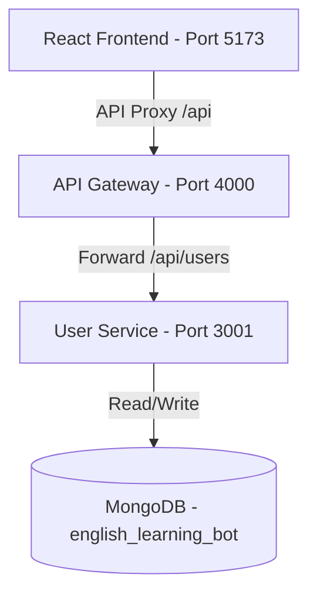

# User Auth and Portal Design Specification

This specification documents the design of the user authentication schemas, the login/signup routes, and the integration of parent/child management into the frontend application.

## 1. System Overview

The system uses a microservices architecture. Client-side requests are routed via an **API Gateway** (running on port `4000`) to the **User Service** (running on port `3001` or `4001`).

---

## 2. Database Schema (Mongoose)

Parents and Children are stored in the same MongoDB collection (`users`) using a **Single Collection Inheritance Pattern**.

### Schema Fields
- `role`: `"parent" | "child"`, required.
- `name`: string, length 2 to 80 characters, required.
- `parentId`: ObjectId references `users` (null for parents, required for children).
- `active`: boolean, default `true`.
- `lastLoginAt`: date, default `null`.
- `email`: string, unique, sparse, parent-only, validated via regex format.
- `passwordHash`: string, parent-only, hidden from queries (`select: false`).
- `username`: string, unique, sparse, child-only, length 3 to 40 characters.
- `pinHash`: string, child-only, 4-digit PIN hash, hidden from queries (`select: false`).
- `age`: number, child-only, optional, range 6 to 12.
- `englishLevel`: string, child-only, optional, `"beginner" | "basic" | "intermediate"`.

---

## 3. API Endpoints (User Service)

| Method | Endpoint | Authentication | Request Body | Response |
| :--- | :--- | :--- | :--- | :--- |
| `POST` | `/api/users/parents/register` | Public | `{ name, email, password }` | `{ user, accessToken }` |
| `POST` | `/api/users/parents/login` | Public | `{ email, password }` | `{ user, accessToken }` |
| `POST` | `/api/users/children` | Parent Only | `{ name, username, pin, age?, englishLevel? }` | `{ user }` |
| `POST` | `/api/users/children/login` | Public | `{ username, pin }` | `{ user, accessToken }` |
| `GET` | `/api/users/children` | Parent Only | None | `{ children: [...] }` |
| `GET` | `/api/users/me` | Authenticated | None | `{ user }` |

---

## 4. Frontend Design

### Zustand User Store (`userStore.js`)
We synchronize store state with `localStorage` to handle page refreshes seamlessly.
- **On mount**: Initialize `user` and `token` from `localStorage` if they exist.
- **On `setUser(user, token)`**: Save user object and access token in `localStorage`.
- **On `logout()`**: Clear `user` and `token` from `localStorage`.

### Login Interface (`Login.jsx`)
- Render tab controls to toggle between Parent Login ("כניסת הורה") and Child Login ("כניסת ילד").
- Form inputs toggle dynamically:
  - **Parent**: Email (`Mail` icon) and Password (`Lock` icon).
  - **Child**: Username (`User` icon) and PIN (`Lock` icon, numeric, max 4 digits).
- Submit action triggers the appropriate endpoint (`loginParent` vs `loginChild`) and redirects to `/portal` or `/child`.

### Parent Portal (`ParentPortal.jsx`)
- Fetch parent's registered child accounts on mount using `GET /api/users/children`.
- Display each child in a responsive card layout.
- Render a "+ הוסף ילד" (Add Child) card that toggles a backdrop-blurred modal dialog.
- The Add Child form collects `name`, `username`, `pin`, `age`, and `englishLevel`. On submission, it executes the child registration API and refreshes the parent's child list.

---

## 5. Error Handling & Validation
- Form inputs validate lengths (PIN must be 4 digits, password must be >= 6 characters, email must be valid format).
- Show inline error messages in Hebrew when APIs return validation failures (e.g. unique username conflicts).
- Gracefully catch connection errors and display friendly warnings.
