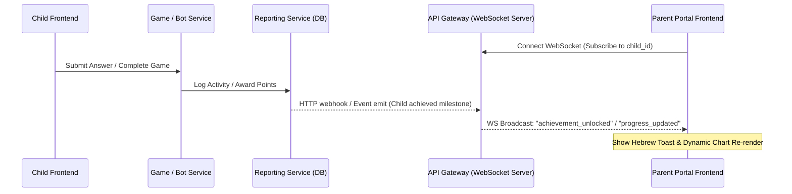
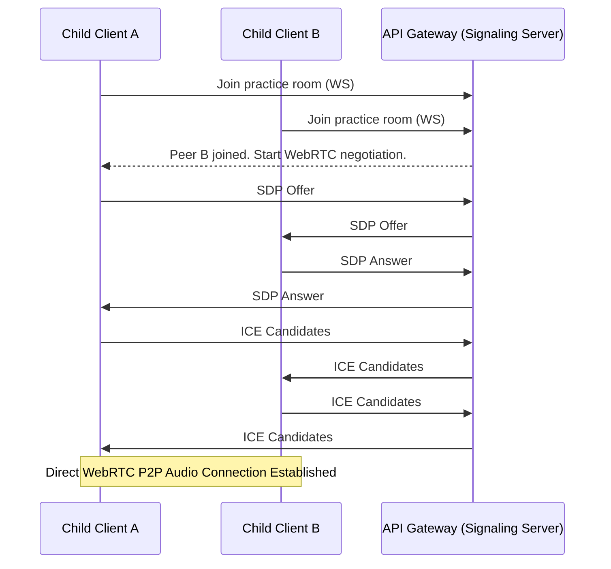

# Design Specification: Real-Time Parent Portal Updates (WebSocket) & English Practice Arena (WebRTC P2P)

This document describes the architectural layout, technical interfaces, and user workflows for the real-time messaging and peer-to-peer audio features to be implemented in Sprint 3.

---

## 1. WebSocket System: Parent Real-Time Notification & Live Progress

### Objective
Provide parents with real-time feedback on their children's learning activities. When a child completes a game, answers questions, or earns a badge, the parent receives instantaneous Hebrew toast notifications and dynamically updating progress charts without refreshing the page.

### Architectural Flow

### Backend Specifications
- **WebSocket Gateway**: Integrate `socket.io` or the `ws` package inside the `api-gateway` service.
- **Service Communication**:
  - The `reporting-service` will trigger a hook (either HTTP POST request or direct redis pub/sub) to the `api-gateway` when a new `ActivityLog` or `Achievement` document is written.
  - The `api-gateway` WebSocket server will emit a real-time event to the room matching the specific `childId`.
- **Database Schema Updates**:
  - `ActivityLog` (in `reporting-service`):
    - `childId`: ObjectId (index: true)
    - `activityType`: String ("game" | "chat")
    - `details`: Object (e.g., gameName, score)
    - `timestamp`: Date
  - `Achievement` (in `reporting-service`):
    - `childId`: ObjectId (index: true)
    - `badgeType`: String (e.g., "grammar_hero_lvl_1", "conversationalist")
    - `badgeNameHebrew`: String
    - `unlockedAt`: Date

### Frontend Specifications
- **Parent Portal Logic**:
  - Open a WebSocket connection upon dashboard mounting, specifying the child ID(s) to subscribe to.
  - Listen for `achievement_unlocked` and `progress_updated` events.
  - Display Hebrew text toast alerts (e.g., "כל הכבוד! דני קיבל תג 'גיבור דקדוק'").
  - Trigger a soft state refresh for Chart components to redraw progress bars/charts.

---

## 2. Peer-to-Peer System: English Practice Arena

### Objective
Allow two children to connect in a direct, secure WebRTC audio session to practice spoken English. The arena helps children overcome speaking anxiety by providing structured conversation starter cards in English.

### Architectural Flow

### Backend Signaling Specifications
- **Room Management**: The WebSocket server in `api-gateway` maintains an in-memory map of active rooms.
- **Signaling Protocol**:
  - `join-room`: Child client joins a matchmaking or direct lobby.
  - `sdp-offer` / `sdp-answer`: Relay SDP session descriptions between the peers.
  - `ice-candidate`: Relay ICE candidate details.
  - `leave-room`: Handle peer disconnect cleanup.
- **STUN/TURN Servers**: Utilize a list of public STUN servers (e.g., google's `stun:stun.l.google.com:19302`) for NAT traversal, and configure optional TURN settings for fallback behind symmetric NATs.

### Frontend Specifications
- **English Practice Arena UI** (`presentation`):
  - Strictly Hebrew controls (e.g., "הצטרף לחדר", "השתק מיקרופון", "עזוב שיחה").
  - A central card space showing visual English cues/prompts (e.g., "What is your favorite animal?").
- **WebRTC Client Handler** (`logic`):
  - Instantiate `RTCPeerConnection`.
  - Capture local audio media stream via `navigator.mediaDevices.getUserMedia({ audio: true })`.
  - Add tracks to the peer connection and handle the remote `ontrack` callback to play the peer's audio stream.
  - Expose mute/unmute functions and connection status indicators (Hebrew: "מתחבר...", "מחובר", "השיחה נותקה").

---

## 3. Security and Constraints
1. **Strict Hebrew UI Rule**: All buttons, status labels, error messages, and system prompts on both the Parent Dashboard and the English Practice Arena MUST be presented in Hebrew.
2. **Audio Traversal Privacy**: WebRTC connections must run under HTTPS/WSS environments to access user microphone media devices.
3. **Graceful Degradation**: If WebRTC fails to connect (e.g., strict corporate firewalls and no TURN path available), the frontend must display a Hebrew warning explaining that their network configuration does not support peer-to-peer audio chat.
